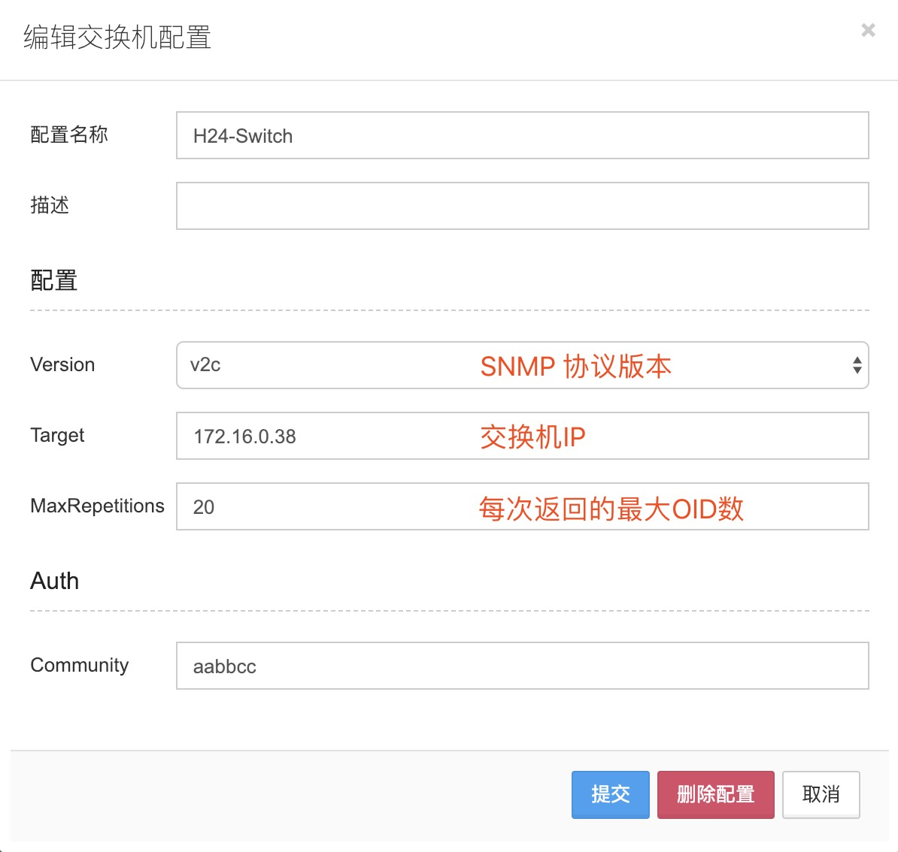
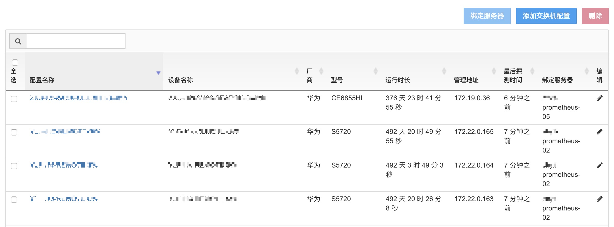
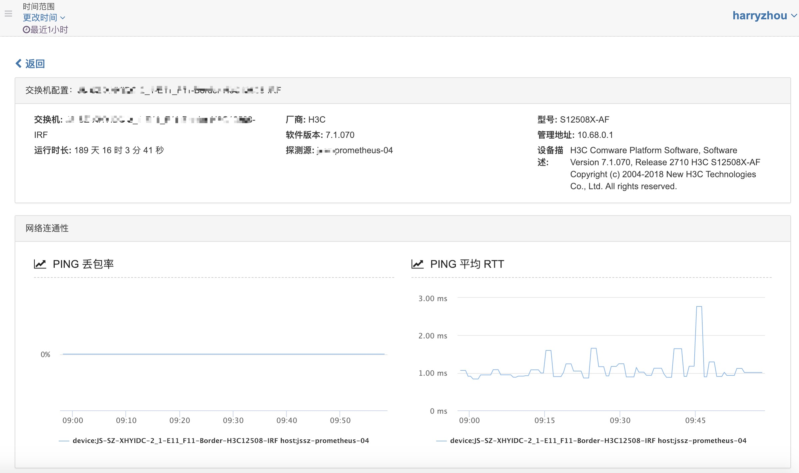
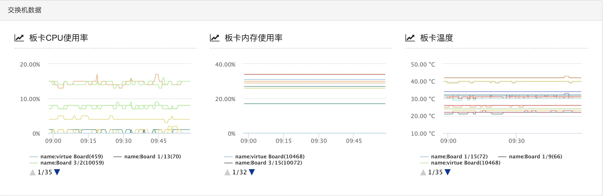
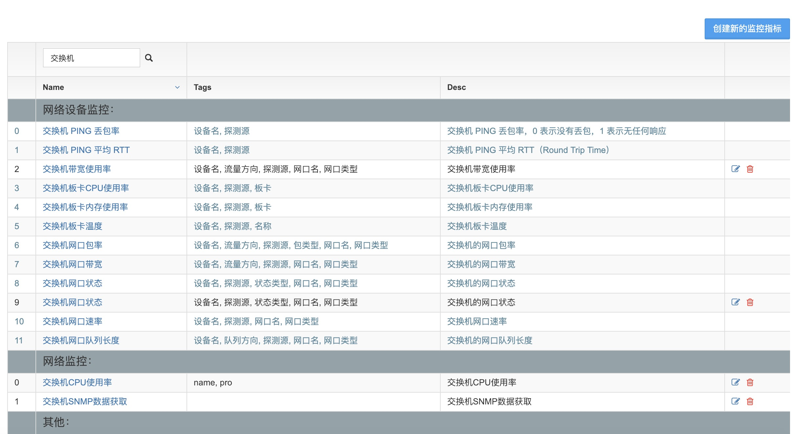
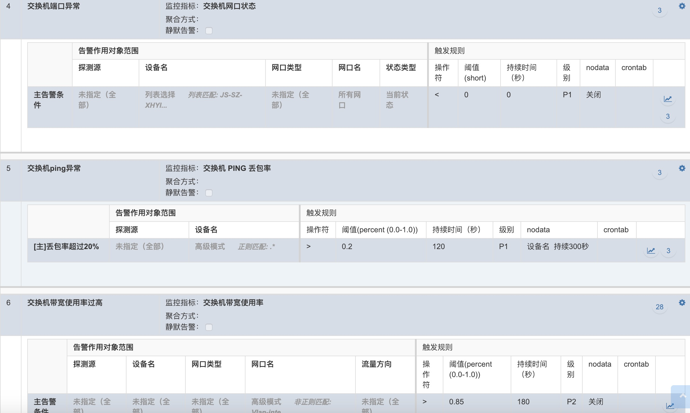

# 交换机

OpsMind 支持交换机的基础性能监控，端口的网络流量监控等，通过安装了 Agent 的服务器利用 SNMP 协议来探测交换机并获取数据。

## 添加交换机

点击 **添加交换机配置**，此处选用 V2C 做模板。

## 绑定探测服务器

添加完交换机后，需要选中交换机，点击右上角 **绑定服务器** ，在搜索框中选择探测源服务器，可以批量选中交换机进行绑定。

## 数据信息

前期通过 OpsMind 工作人员针对不同厂商以及型号的交换机进行 **OID** 适配，我们能获取到诸如以下类型的数据：

**网络连通性**

**交换机硬件数据**

**网口数据**

## 交换机监控指标

通过 SNMP 协议获取到的各类交换机数据的详细信息，我们在监控指标中提供更详尽的数据查看。具体参见《监控指标-指标项查看》。

## 交换机告警策略

通过各类监控指标，可以添加适合业务场景的告警策略。具体参见《告警策略-告警创建》。

