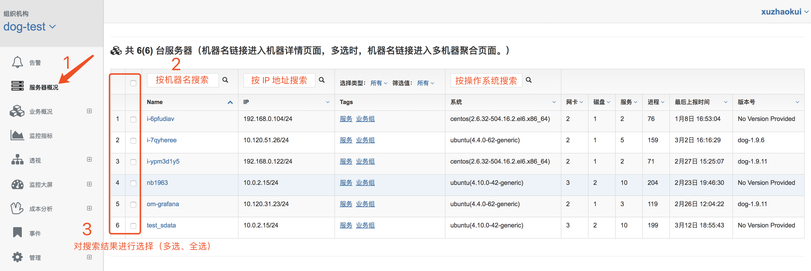
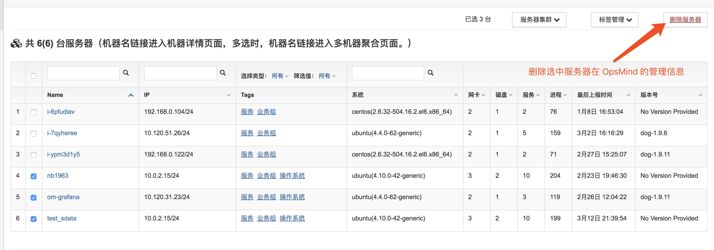

# 服务器

在 OpsMind，您可以通过对机器名、IP地址、操作系统版本等多维信息进行搜索，并使用标签功能对所有的机器进行分组管理、交叉查询等灵活的管理操作。

## 1. 纳入新服务器

OpsMind 系统中，只要一台服务器正确安装了监控 Agent，那么该服务器会自动被纳入管理，无需额外的手工配置。

## 2. 服务器重命名

对于一台新发现的服务器，默认会使用其主机名作为这台服务器的标识名称。若需要调整，则点击服务器名称右侧的编辑按钮即可实时重命名。

## 3.服务器搜索

如上图所示，点击左侧菜单栏中的 **基础设施-服务器**，右侧会出现所有安装了监控 Agent 的服务器列表，表格中会列出每台服务器的关键信息：机器名、IP 地址、标签、操作系统等。

其中，机器名、IP 地址、标签、操作系统信息均可以进行灵活地搜索（包括组合搜索），下方表格会实时显示满足搜索条件的服务器列表。

## 4. 新建服务器标签类型

 

服务器的标签均为 **标签类型 : 标签值** 格式，以上图为例：

1. 搜索操作系统中包含 `ubuntu` 字样的服务器
2. 选中部分服务器
3. 点击右上角 **标签管理**，在输入框输入新标签类型的名称：操作系统，点击勾号创建
4. 在弹出框中输入标签值，这里为 ubuntu，保存即可

刷新页面后可以看到，一些机器的标签栏中出现了 **操作系统** 这个标签类型，鼠标悬浮后会显示这台服务器在该标签类型下的标签值：`ubuntu`。

## 5. 使用已有标签类型（或标签值）

若之前创建过标签，也可在选中目标服务器后，点击 **标签管理** 下拉，会出现已存在的标签名。点击标签名后即可编辑标签值，也可复用已存在的标签值。

## 6. 删除标签

您可以对一台或多台机器进行标签的删除操作（即解除这些机器与被删除标签的关系）：

如上图所示，您可以选择只删除某个标签类型下的特定标签值，也可以选择删除这个标签类型。如果选择了后者，那么刷新页面后，这些机器上的标签栏中将不会出现该标签类型（以这里为例就是`操作系统`）。

## 7. 标签搜索

通过标签栏顶部的下拉框，您可快速地根据标签类型和标签值对服务器进行搜索，例如要过滤出所有操作系统为 ubuntu 的机器列表，您可以这样操作：

 

## 8. 预置标签类型

OpsMind 有三类预置（系统内置）的标签类型，分别为：

* 服务
* 业务组

对于新纳入监控的服务器来说，系统会默认为每台服务器自动打上服务标签，例如：

服务标签是指在该服务器上，监控 Agent 自动发现的服务列表（关于如何鉴别一个服务，请参考服务监控）。 而业务组标签是指在该服务器上运行着哪些业务组（关于如果鉴别一个业务组，请参考服务监控）的服务。

需要注意的是，这预置均由系统根据真实监控结果计算生成，因此不可在服务器列表页面进行编辑。

## 9. 删除服务器

注意，这里的删除服务器并非是真的下线服务器，而仅仅是删除某台服务器在 OpsMind 系统中的信息。常用于服务器物理下线后，在 OpsMind 中手动删除该服务器以防有不必要的告警信息出现（例如服务器掉线告警）。

OpsMind 支持对多台选中的机器进行批量删除，例如：

由于服务器只要存在上报，OpsMind 就会自动纳入管理，所以对于一台仍在正常上报的服务器来说，在 OpsMind 页面上删除该服务器其实并不会产生什么实际效果（因为一段时间后该服务器又会被纳入进来）。

