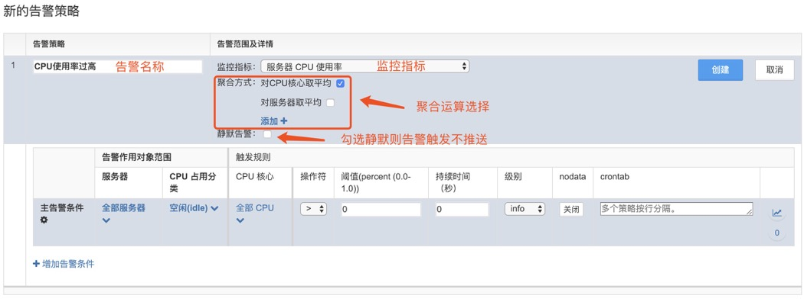
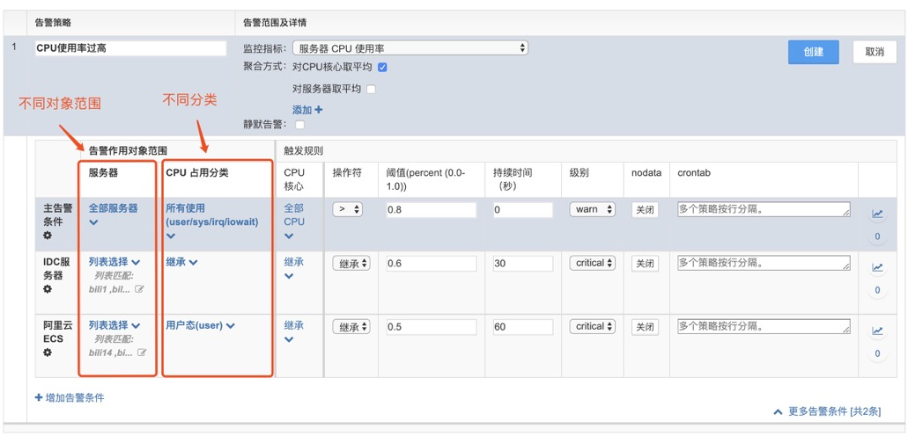
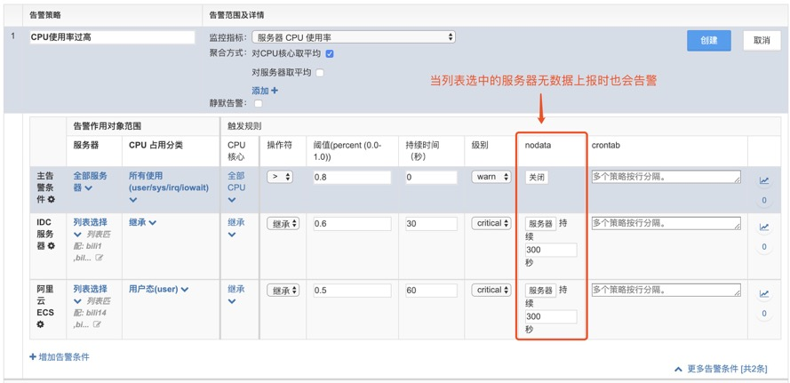
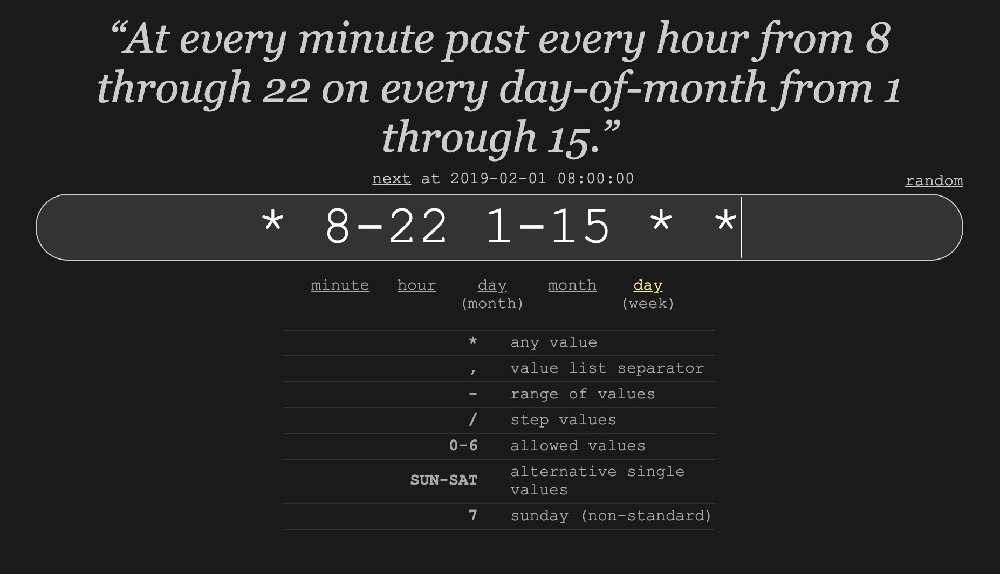

# 告警创建

## 新建告警策略

输入告警策略名称，选择对应的监控指标项，并配置告警条件。

告警微调设置

支持多场景、多阈值、多操作符、多级别告警设定。

支持无数据上报方式，补充运维场景的需求。

## 告警推送时间设定

在告警策略设置界面，触发规则选项中有一栏 crontab。点击告警编辑，在 crontab 窗口下即可编辑时间戳。具体语法可参照 https://crontab.guru

Crontab 语法规则：

Crontab 语法参考：

场景一：每周一至周五，8：00-22：00 时间段推送告警，其他时间段告警静默。

场景二：每个月1号-15号，8：00-22：00时间段推送告警，其他时间段告警静默。

OpsMind 告警配置界面展示：

