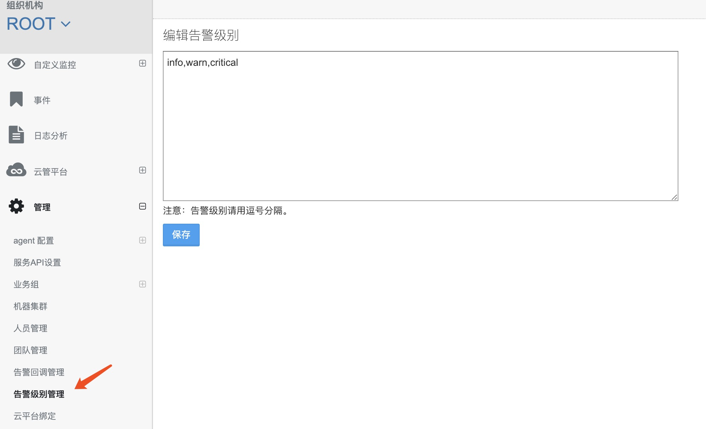
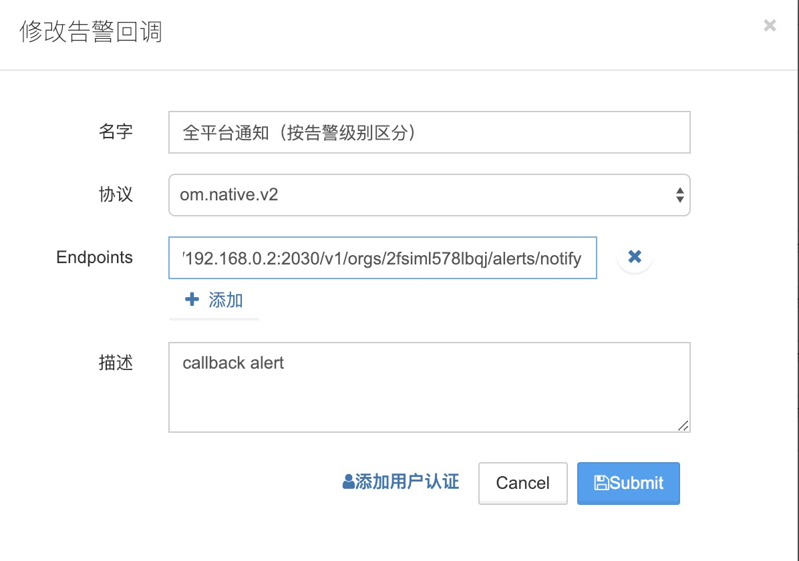
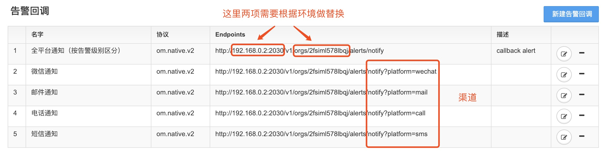
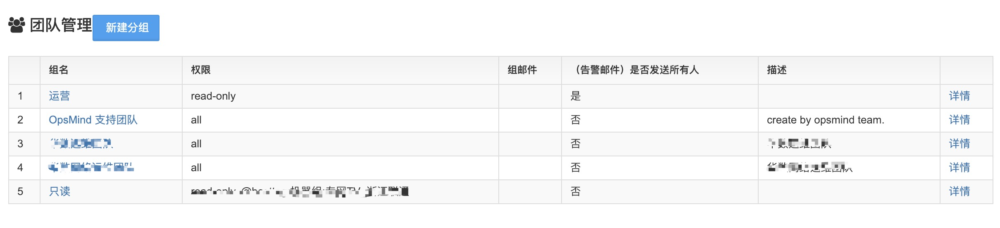
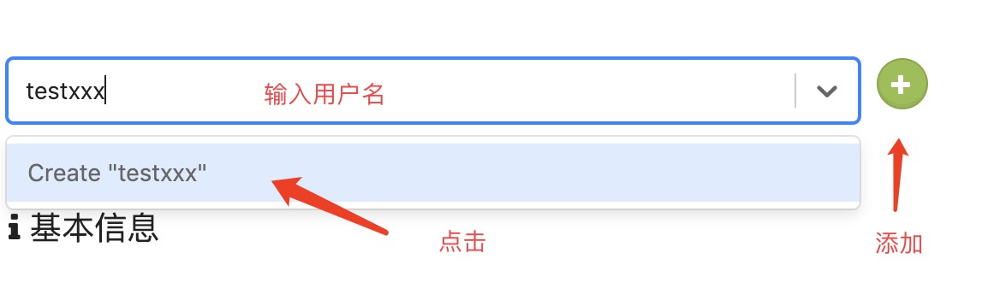
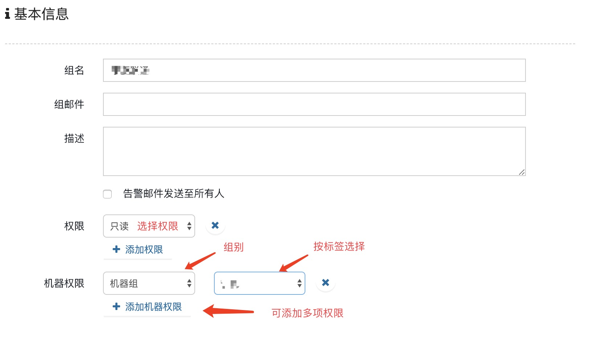
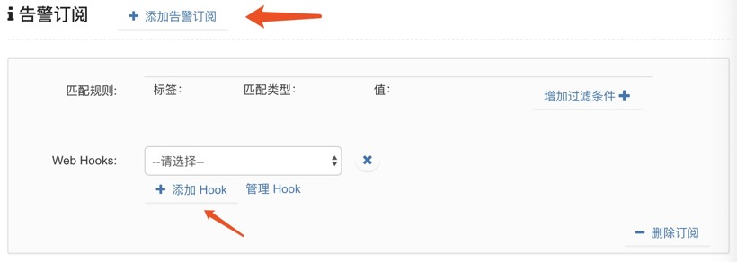
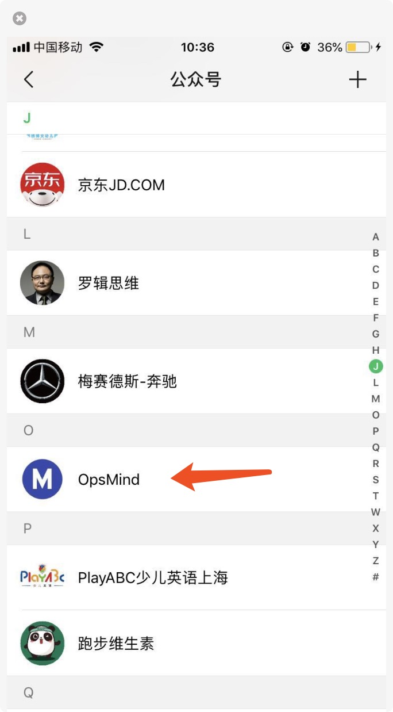

# 告警管理

## 告警级别

我们默认的告警级别是：info、warm、critical 三个级别，也支持自定义设置如：P0、P1、P2、P3 等多级。

设置方法，左侧菜单 **管理—告警级别管理**。

## 告警回调

设置方法，左侧菜单 **管理-告警回调管理**。

协议选择：om.native.v2

Endpoints：http://**192.168.0.2:2030**/v1/orgs/**2fsiml578lbqj**/alerts/notify  根据环境替换 IP 和 Org id 一般情况下 IP 是 OpsMind 服务端 server 的 ip，Org id 对应 root org。通常此处会由工作人员协助设置。

默认通知渠道有四种：微信、邮件、电话、短信。另外提供接口调用，支持更丰富的渠道。

一般告警通知会根据级别的高低来使用不同的渠道，可参考下图配置。

## 告警订阅

我们支持电话、短信、邮件、微信等告警推送方式。支持不同分组不同订阅等设置。

左侧菜单管理—团队管理，选择对应的组名，点击进入。

人员添加：输入需要添加的用户名，点击 Create "XXX"，再点击 +。

群组权限设置：设置组名，权限可分只读和读写，机器权限可按标签分配机器组。

告警订阅的渠道设置：下拉菜单选择，可添加多项（如已设置，请忽略）。

在 WEB 端登录自己账号的情况下，右上方点击自己账号，选择平台绑定，小苗自己账号下的微信二维码（90 秒内有效），若过期请刷新。

手机端—微信公众号

