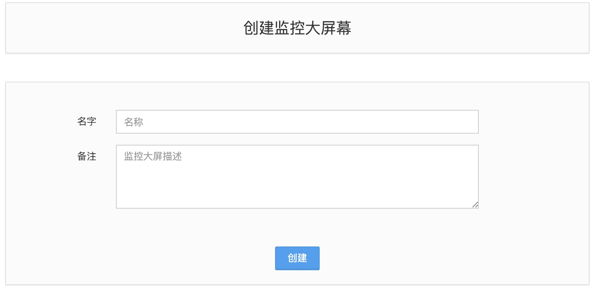
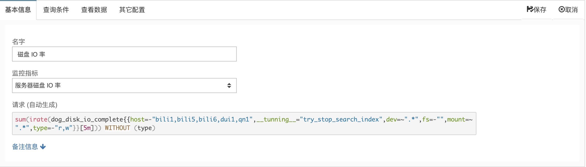
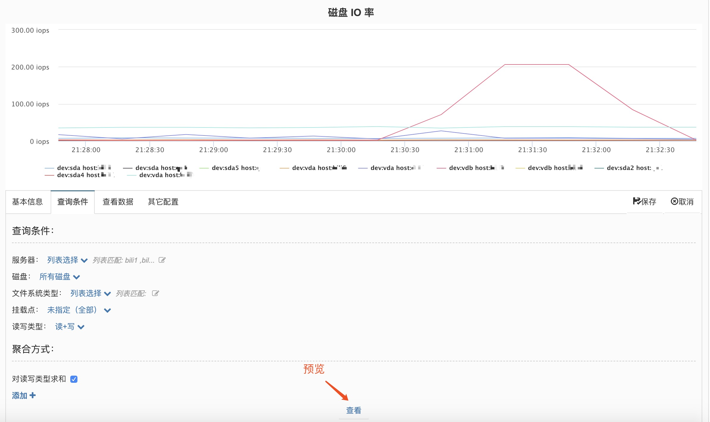
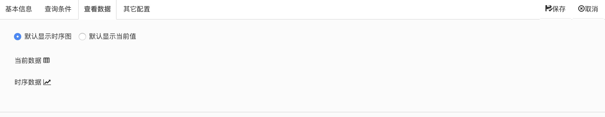
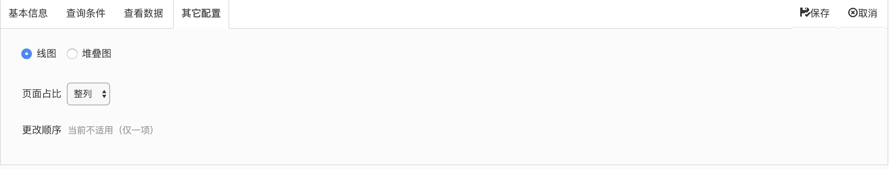
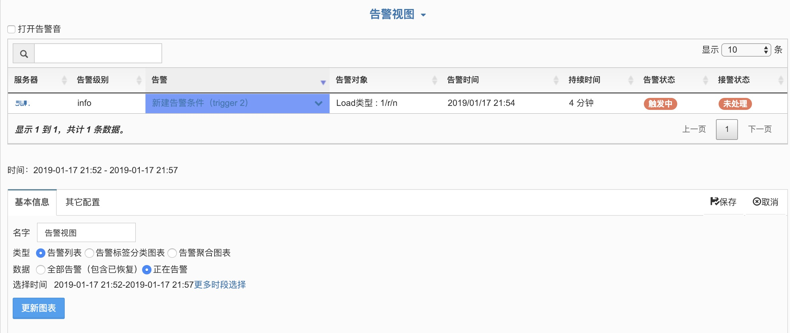
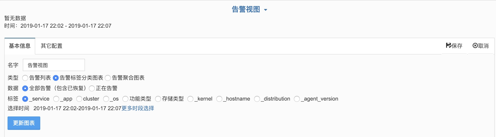
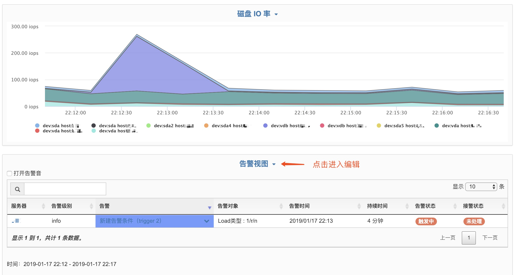
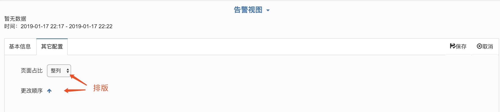
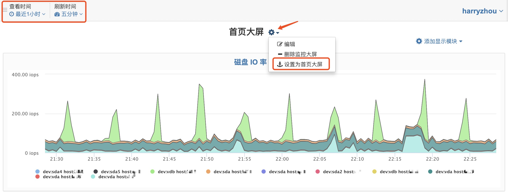

# 监控大屏（Dashboard）

我们支持将监控指标、告警视图添加到首页大屏，以便关注重要的监控告警信息。

## 创建监控大屏

点击 **创建**，输入大屏名字。

## 配置监控大屏

在 **监控大屏** 下选择刚才创建的大屏，进入配置界面后选择右上方 **添加显示模块**。

**添加监控指标：**

基本信息：输入名字、下拉菜单选择需要的监控指标。

查询条件：根据需要展示的内容，选择相应的查询条件范围和聚合方式，点击 **查看** 可以预览。

查看数据：选择一个数据默认显示的类型，时序图或当前值。

其他配置：**页面占比** 用于排版大屏。**线图**、**堆叠图**，用于样式选择。

最后点击保存，完成配置。

**添加告警视图：**

告警视图类型分为：

1. 告警列表：所有的告警内容全部显示。
2. 告警标签分类图标：根据不同标签来显示告警内容。
3. 告警聚合图标：通过聚合维度显示告警分析。

其他配置：设置页面占比。最后点击保存，完成配置。

## 大屏排版

在创建完所有需要查看的图标以后，可重新点击视图名进行编辑，在 **其他配置** 中调整。

左上方可以设置数据的查询时间范围，还有页面的刷新时间。最后点击大屏名称，点击 **设置为首页大屏**。完成后在左侧菜单栏 **首页** 即可查看。

