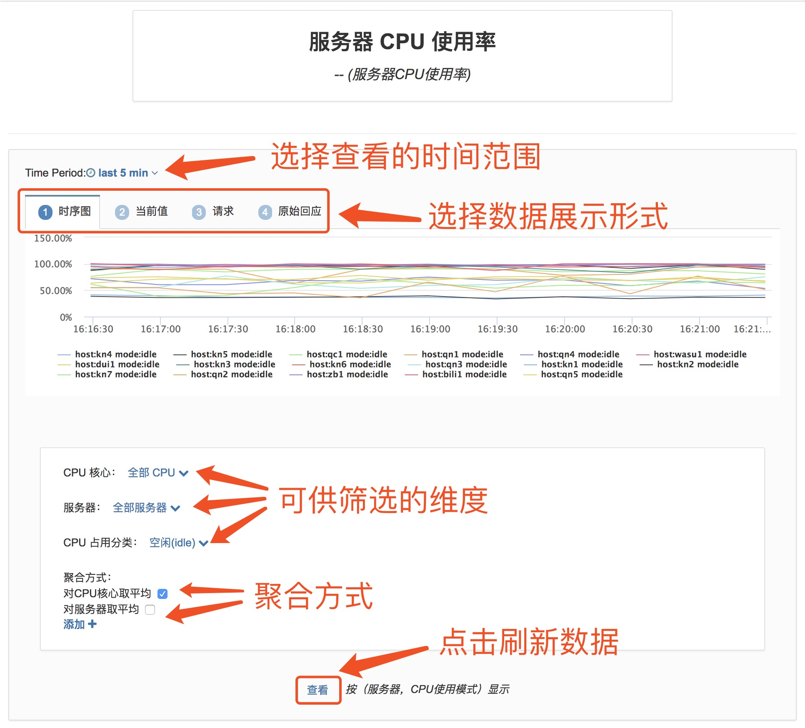
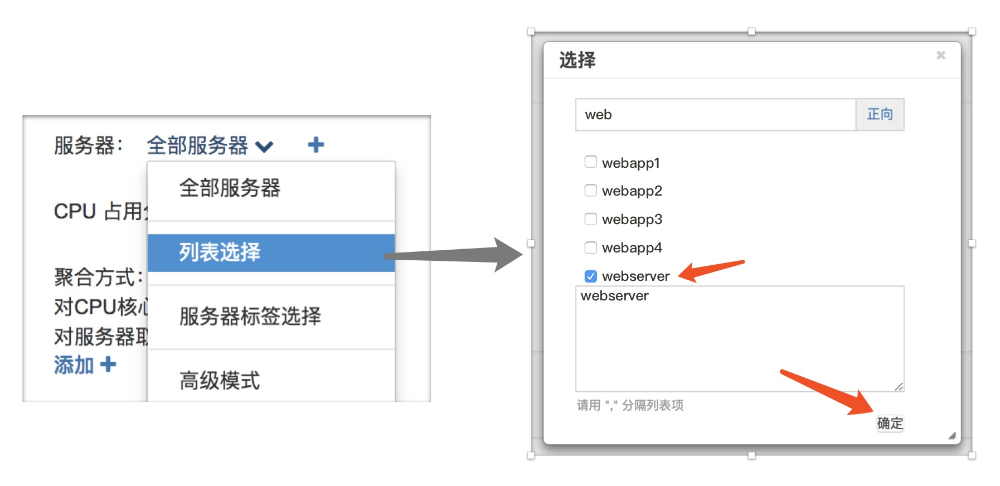

# 指标项查看

## 查看指标项

点击菜单左侧的监控指标一栏，右侧会列出当前系统内已有的所有指标项：

列表中会列出每个指标项的名称、可筛选维度以及这个指标项的具体含义和功能。点击单个指标项的名称，会弹出该指标数据的实时查询页面。

## 数据展示形式与原始查询

指标查询界面支持三种数据展示模式、以及查看原始查询的功能。您可以通过点击标签进行切换。

**时序图**（以线图方式展示每个维度组合随时间的变化）

**当前值**（以表格方式展示每个维度组合的当前值）

和时序图不同，当前值模式只会显示每条时序的当前值，value 一列的表头可用于对值进行快速排序。

**原始回应**（查看服务端返回的原始数据格式）

此数据一般用于 API 对接时的调试。

**请求**（查看根据下方选中条件最终生成的查询语句）

此生成的查询语句可用于类似 Grafana 这样的开源画图工具，请参考 **外部整合** 一节。

## 指定筛选条件

仍以指标项 **服务器 CPU 使用率** 为例，该指标项的含义是记录每台服务器上，每颗 CPU 核心处于每种运行模式（用户态、内核态、IO等待、软中断等）下的时间占比，因此这个指标项拥有以下筛选维度：

1. 服务器
2. CPU 核心
3. CPU 运行模式

您可以通过指定一个或多个维度的匹配条件从所有的数据中筛选中您关心的指标数据。例如给出以下删选条件：

1. 服务器名为 "webserver"
2. 全部 CPU 核心
3. 运行在用户态模式下

意味着您就可以得到名叫 "webserver" 的这台服务器上全部 CPU 核心处于用户态模式下的时间占比。

以指定服务器维度为例，您可以：

1. 点击服务器维度右侧的下拉列表
2. 选择 `列表选择`
3. 在弹出的服务器列表中找到并勾选目标服务器，点击确认

除了列表选择外，您也可以使用更高级的匹配模式：

1. 服务器标签选择，使用服务器标签筛选服务器列表
2. 高级模式，使用正则匹配、取反操作

## 选择时间范围

你可以通过左上方的时间选择按钮对查询的时间范围进行精确的限定：

选择完毕后，点击下方确定按钮刷新数据。

## 选择聚合方式

OpsMind 支持对指标数据进行灵活地计算与聚合，将多维的数据进一步的处理得到最终结果。仍以指标项 **服务器 CPU 使用率** 为例，若需计算所有选中服务器的平均值，那么可以在聚合方式下勾选 **对服务器取平均**，然后点击确定刷新数据。

除了取平均，OpsMind 还支持：求和、取最大值、取最小值、取标准差、取方差、取最大十项、去最小十项等聚合方式。

