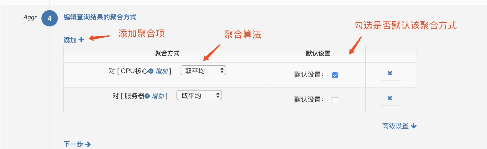

# 指标项创建

右上角点击 **创建新的监控指标项**，可搜索自定义指标项名称添加。

输入监控指标名称，并选择对应分类；我们的数据查询支持原生 Prometheus 的各类算法，并做了一定的简化和扩展；根据指标选择适合的单位；最后填写对指标的描述。

编辑每个维度的信息：名称、类型等。此处可以对维度添加预设值和依赖对象，如下图所示。

查询结果显示信息设置

设置聚合方式及集合算法，根据使用场景有些聚合算法可以勾选为默认，如下图所示。

在设置完以上的信息后，可以在此步骤模拟查看指标项，来检查问题（有无数据，数据是否显示正常，聚合是否合理）。

完成指标创建后可在 **监控指标** 中检索查看，并配置告警策略。

