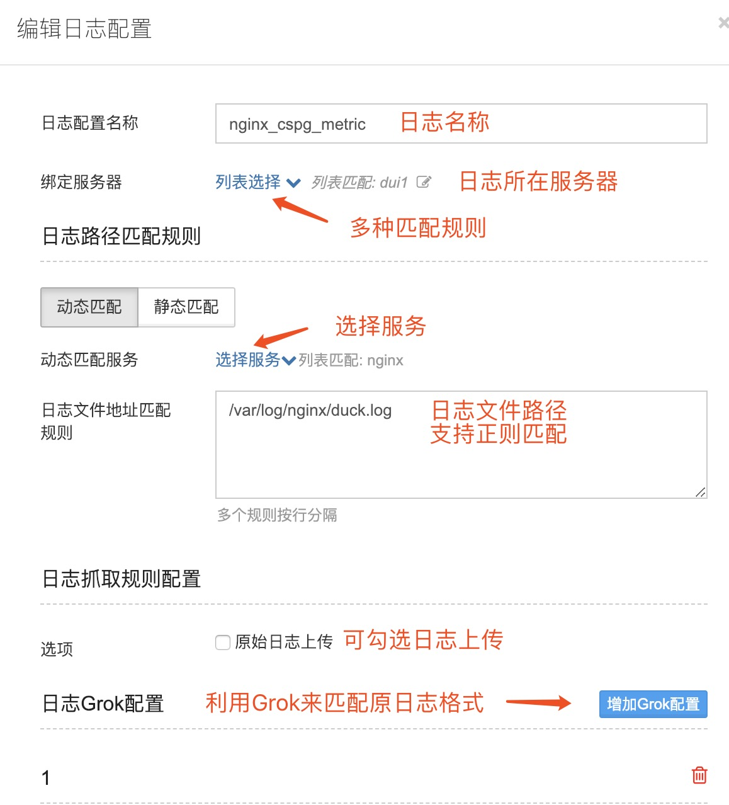
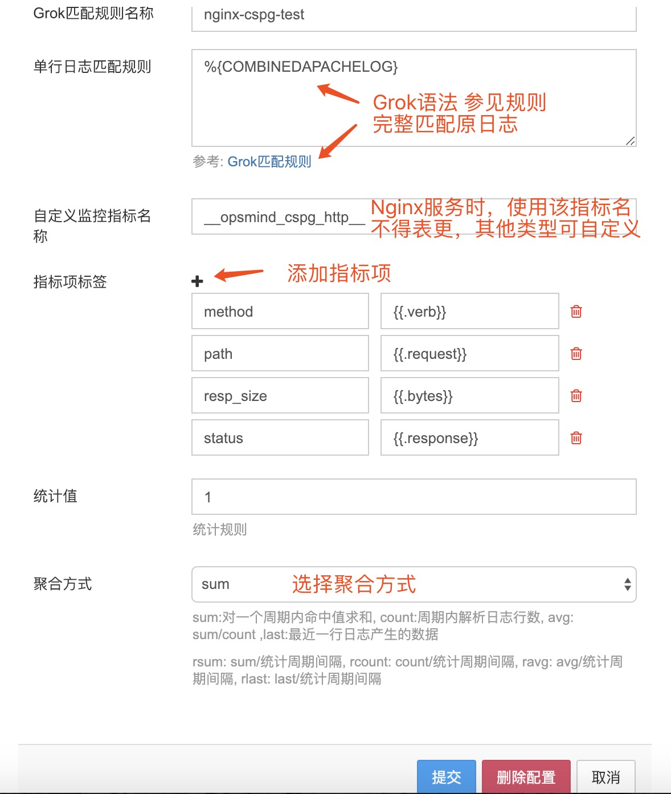
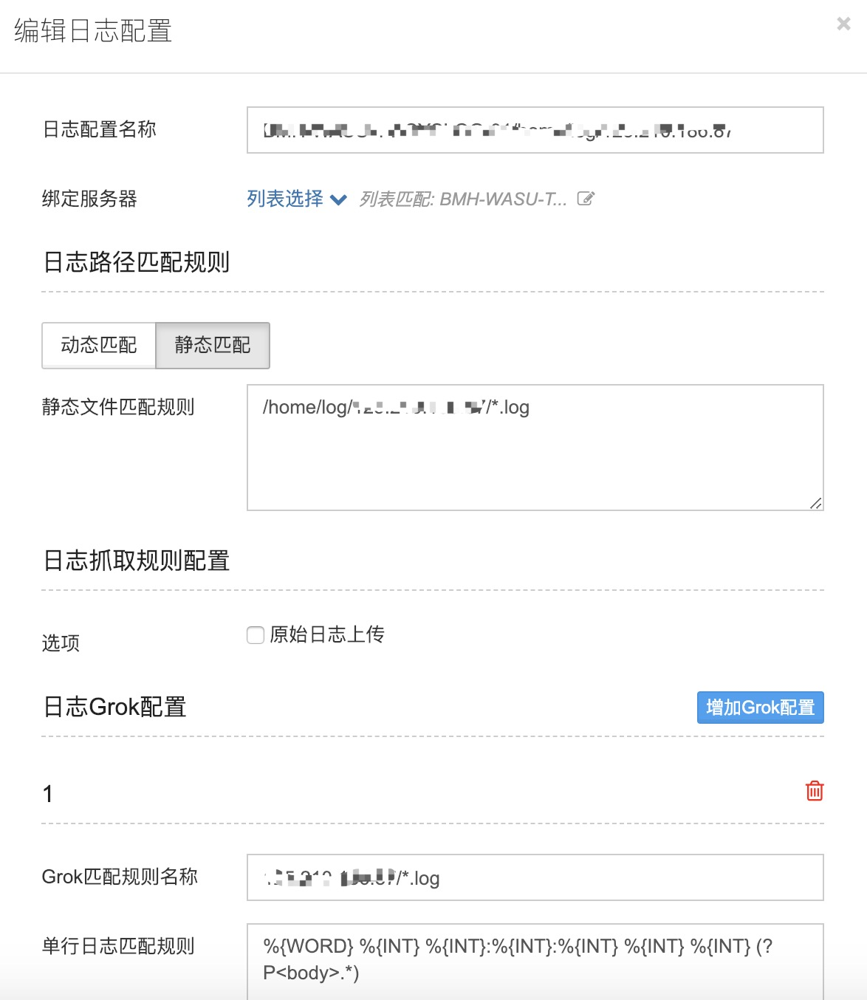
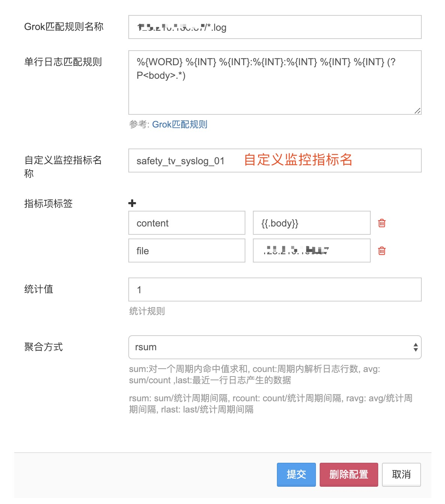
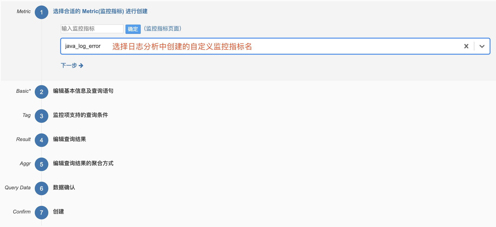
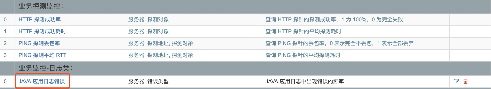
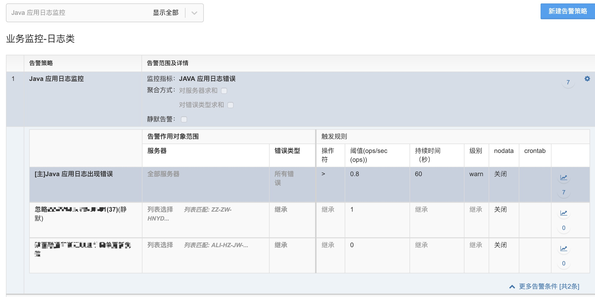

# 日志分析（ Log Analysis）

OpsMind支持日志收集，日志解析功能。某些运维场景下，在无法直接获取指标项时，通常需要通过日志来查看并分析服务的运行状态，以便定位问题。

## 动态匹配

这里以某Nginx服务为例，场景为https请求。由于协议加密的原因，无法通过抓包直接分析，我们可以通过分析Nginx的日志来获取method、path、resp\_size、status等指标。

1. Grok语法用于正则匹配日志
2. 自定义监控指标名称-生成监控指标，可在 **监控指标** 功能中查看并配置告警（当解析Nginx https请求日志时，自定义监控指标名如图所示，不得更改）
3. 指标项标签-添加所需要的metric

## 静态匹配

## 日志监控

1. 在监控指标菜单中创建新的监控指标
2. 输入自定义监控指标名
3. 剩余步骤参考《监控告警配置》

