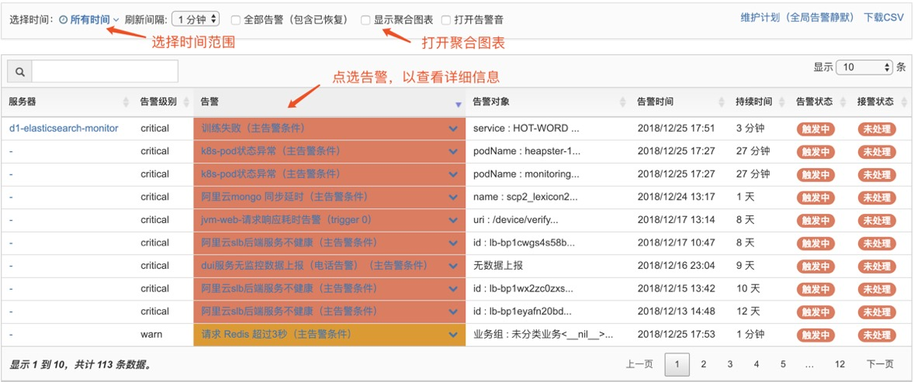
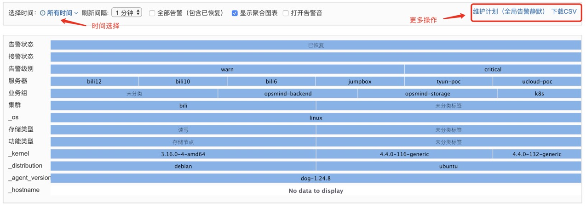
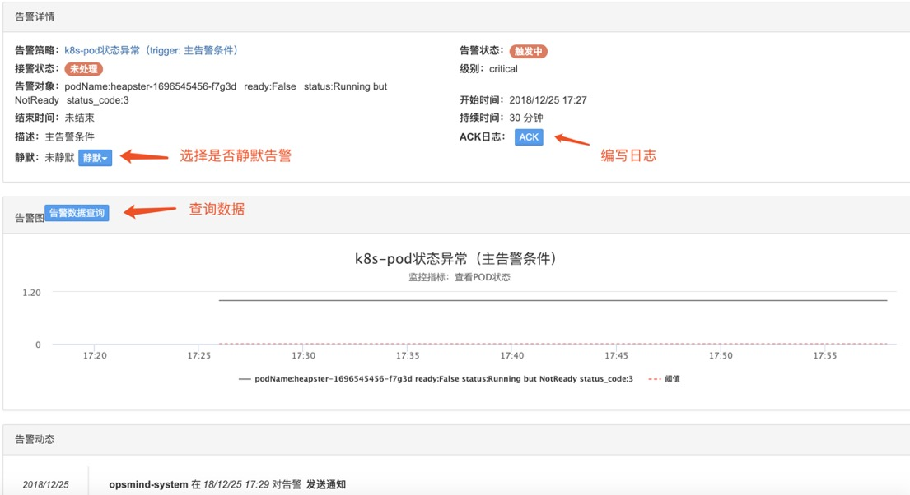
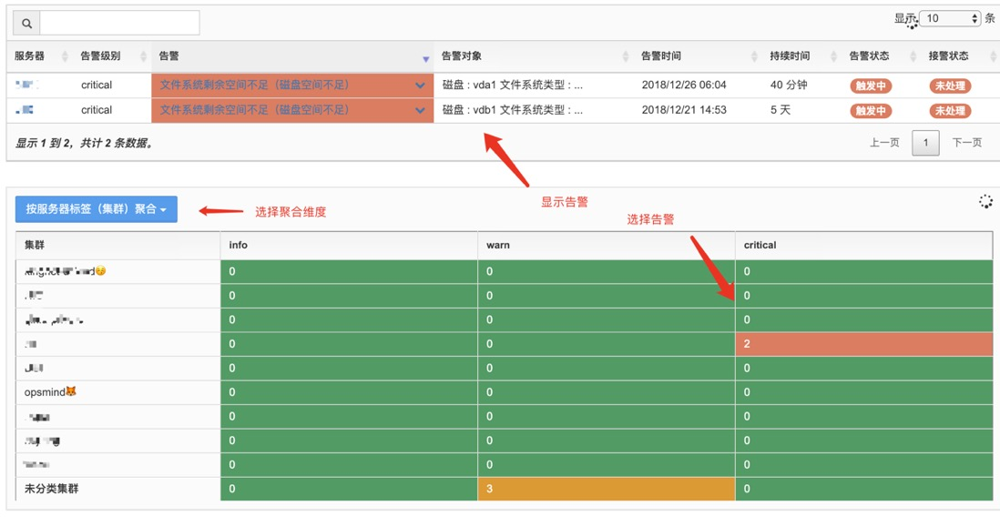

# 告警透视

OpsMind提供实时的告警分析功能，帮助运维人员快速判断当前的告警热点，以加快故障定位的速度。

聚合图表，告警维度分析：

在告警透视页面上，勾选显示聚合图表，下方会根据选择的条件，将期间内的告警进行维度分析、聚合

其中蓝色的横条分别代表左侧说明的维度，蓝条的长度代表每个维度值占的比例。例如在 **级别** 一栏中，warn 级别的告警比 critical 级别的告警略多一些（warn蓝条长度略长一些）

其他维度一次类推，这张维度分析图可以帮助您：

1. 发生大规模告警时，能快速找到告警的共性维度（比如是否是一个集群等）
2. 对历史发生的告警进行分析复盘，有针对性地对系统进行运维升级

详细告警信息

点击告警列表中的告警名称，可以进入告警的详情页面，这里您可以查看：

1. 查看告警的快照
2. 查看告警发生的时序图表
3. 对告警进行，ACK、静默、评论等操作

多维度进行聚合

若选中了某个服务器标签维度（下图以集群标签为例），所有的告警会按照标签进行归类

