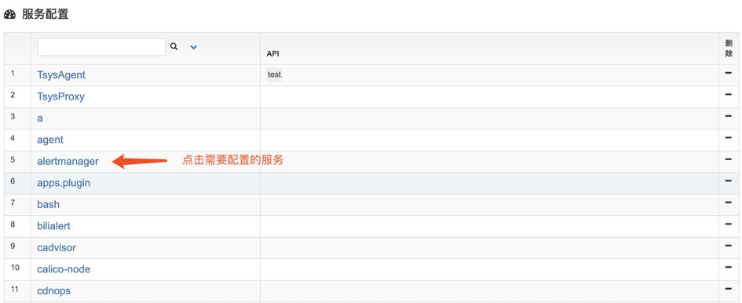
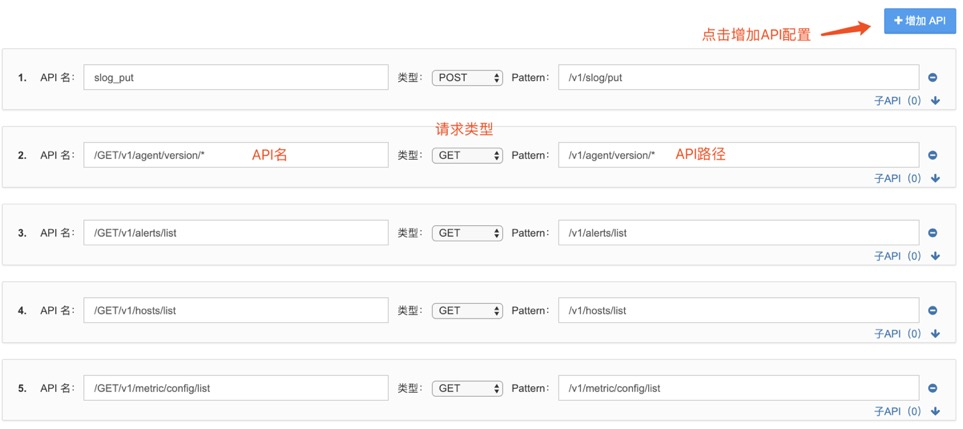
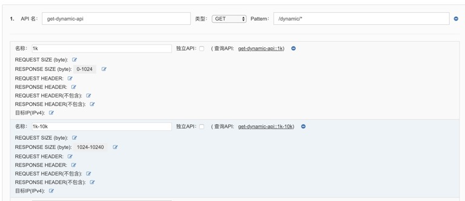

# 服务 API 设置

OpsMind 支持增加 API、和子 API的配置，用于监控服务之间 API 调用的状态。配置完成后，可在服务透视中看到相关请求数据。当服务器上安装了 Agent 以后，会自动解析出当前运行的服务，以便我们进行配置。

在左侧菜单 **管理** 选项下，进入 **服务 API 配置**，选择任意一个服务，点击服务名进入 API 配置界面。

API 配置

子 API 配置，点击子 API 下拉框进行配置，如下图。

