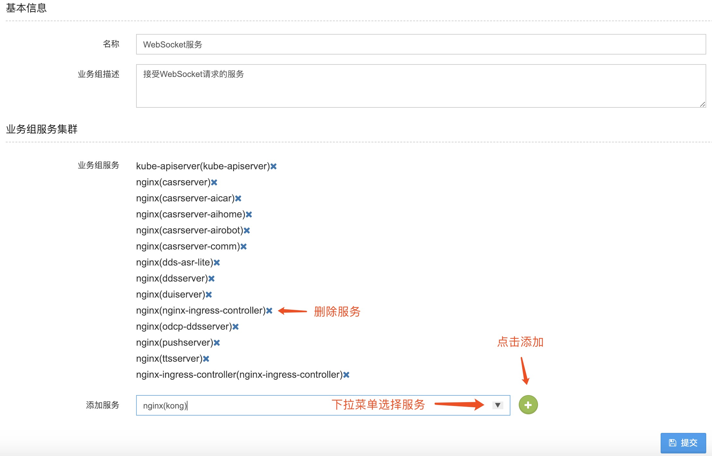
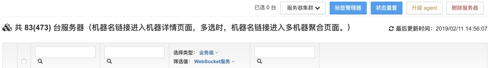
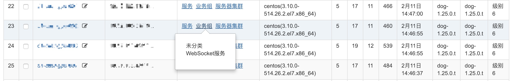
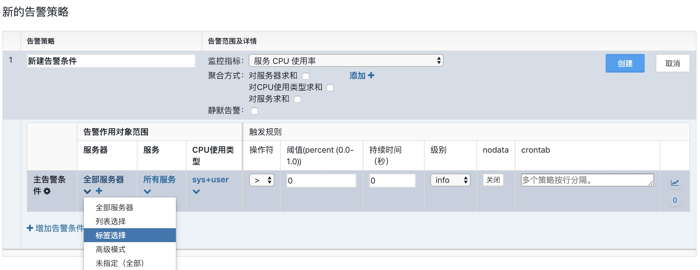
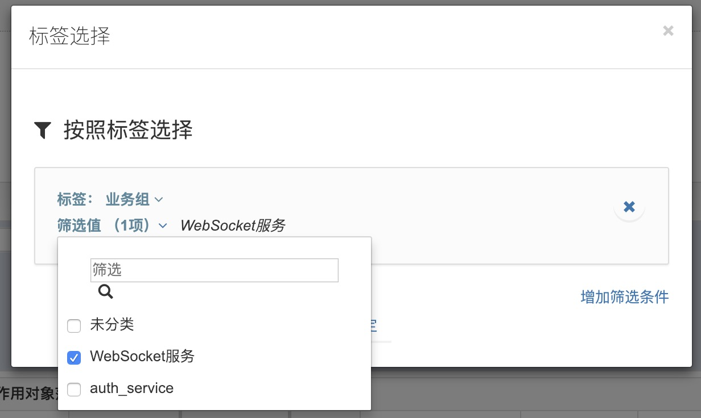
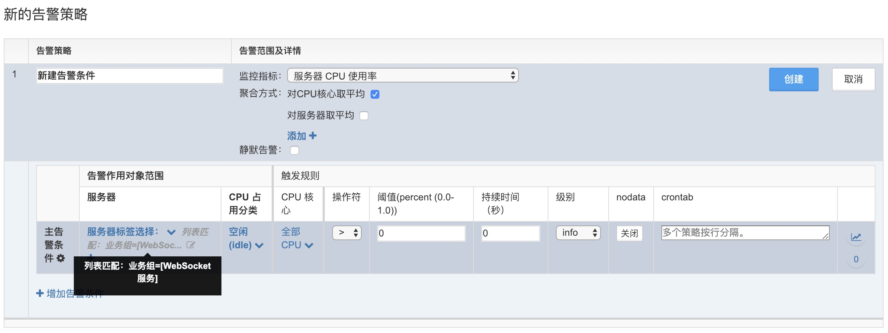

# 业务组

为了更好的对服务器进行管理，我们提供了 **业务组** 的分类功能（可添加对应业务的所有服务）给服务器增加一个标签选项。

左侧菜单，**管理—业务组—创建业务组**。

**业务组** 功能应用：

在 **基础设施-服务器** 功能中，查看筛选服务器。

在告警策略中利用业务组标签进行对象分类。

创建告警策略，在告警作用对象范围处，点击全部服务器选择 **标签选择**。

标签选择 **业务组**，然后选择对应业务组名称。

设置完以后，告警策略的作用对象范围会根据设定的 **业务组** 进行匹配。

在团队管理中，进行告警权限指定：

