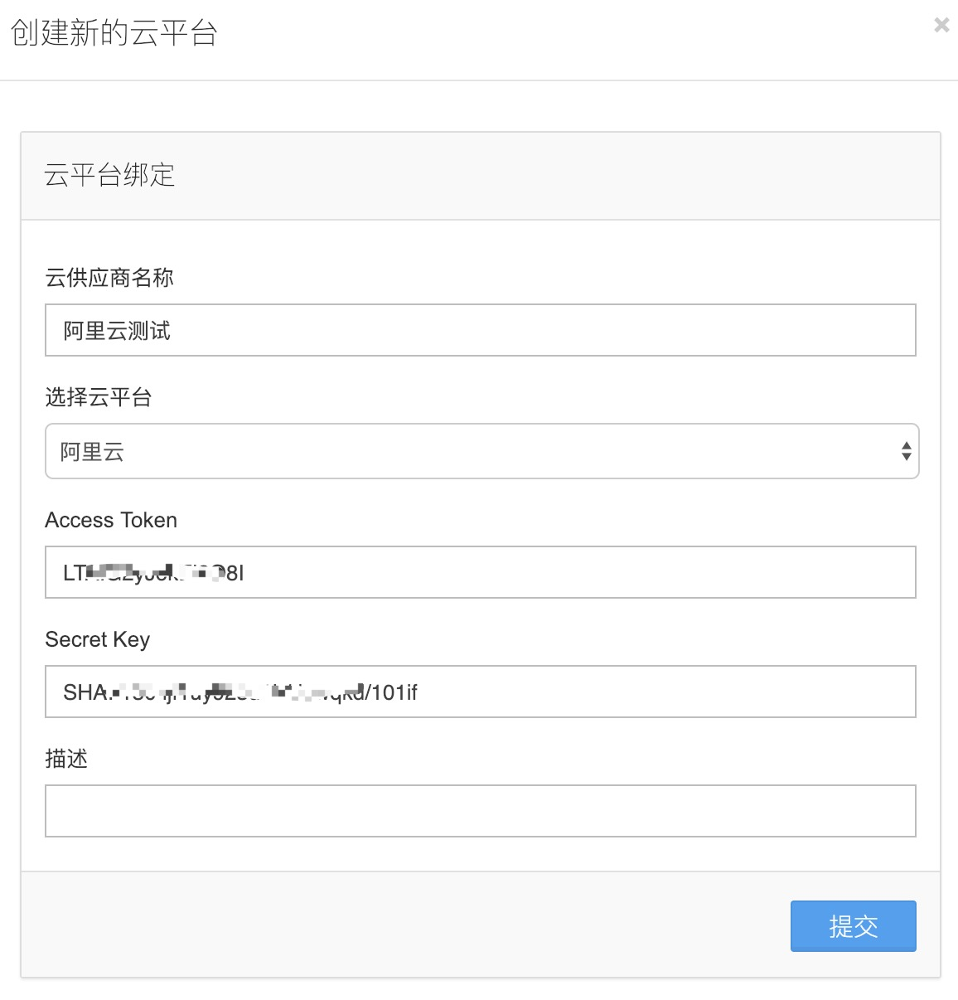
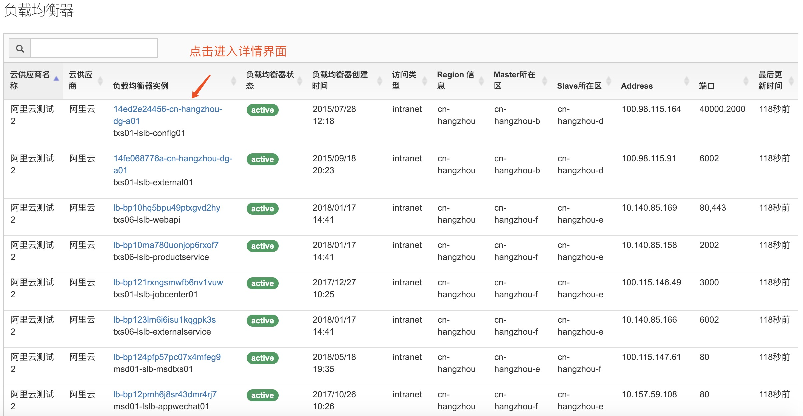
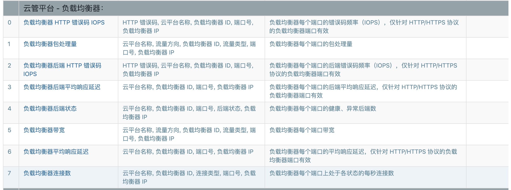
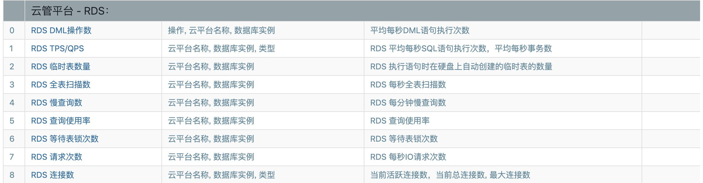

# 云管平台（Cloud）

目前支持阿里云、腾讯云上的部分服务监控，如负载均衡器、关系数据库、弹性云主机，未来会支持更多的共有云服务商。

通过云管平台的支持，我们可以在混合云环境下，对资源进行统一的管理和监控，结合 **CMDB Workflow** 发挥更多的想象，实现批量处理任务、告警自愈、流程审核、成本统计等自动化运维场景。

## 关联账号

在左侧菜单 **管理-云平台绑定** 中添加账号，平台的 Accesskey 从账号中查看。

## 负载均衡器

左侧菜单 **云管平台-负载均衡器**：

在监控指标中查看 **负载均衡器** 详细数据：

在监控指标中查看 **关系型数据库** 详细数据：

