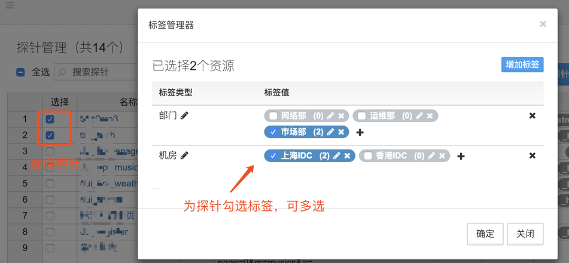
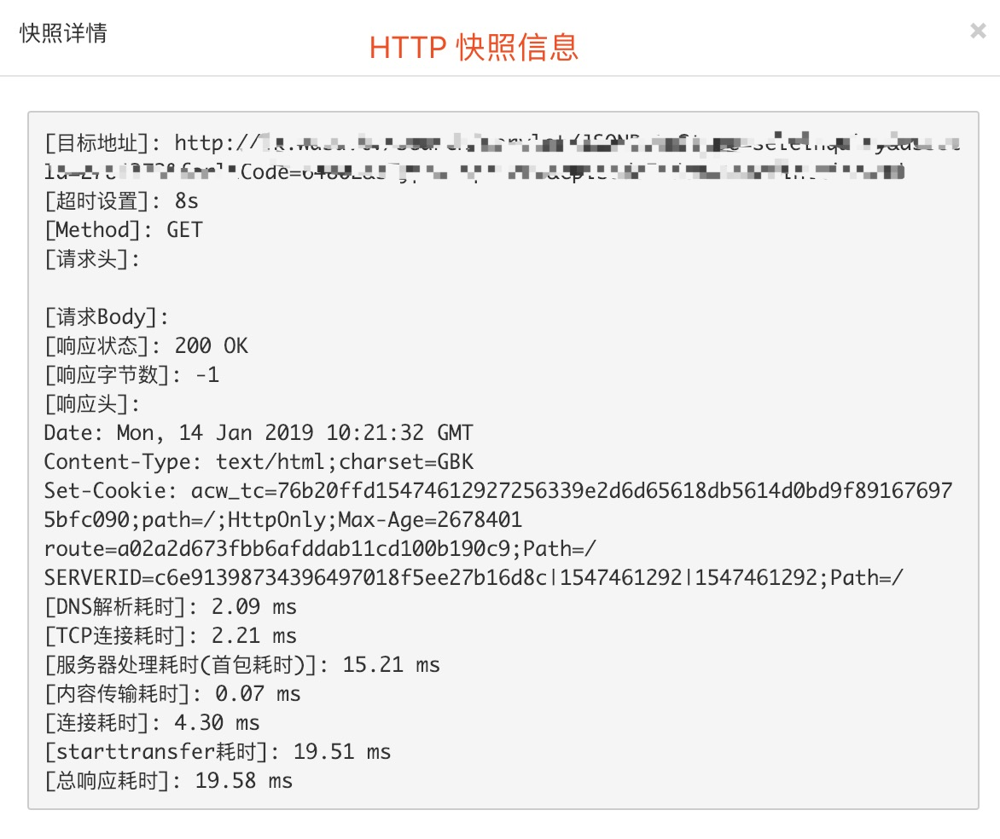

# 探针

OpsMind 支持配置多种类型的探针，用于定期对一个黑盒系统进行健康检测和数据抓取。

## 新增探针任务

### HTTP 任务

点击 **增加协议探针**，设置探针名及描述，探测源类型选择 **idc** 协议类型选择 **Http**。

点击 **选择探测服务器**，**增加筛选条件**，匹配条件有多种可选，例如：列表匹配，下方筛选值处可单选或多选探测源服务器。设置完成后点击绑定，完成探测源绑定，然后点击 **确定** 进入下一步配置。

Http 协议配置：请求方法、URL 地址、HTTP 头部、超时时间、探测间隔、状态码、响应内容等信息。

### TCP 任务

点击 **增加协议探针**，设置探针名及描述，探测源类型选择 **idc** 协议类型选择 **TCP**。

### ICMP 任务

点击 **增加协议探针**，设置探针名及描述，探测源类型选择 **idc** 协议类型选择 **ICMP**。

## 探针管理

### 批量设置探测源

如果有大量探针需要批量配置，可以先配置探针的协议部分，探测源可以先不选定，待探针配置完后，在这里批量选定后点击 **设置探测源** 来统一设置（前提是这些探针的探测源相同）。

### 标签管理器

我们可以利用标签来丰富探针任务的管理，例如部门使用的划分、具体用途区分等应用场景。

1. 选择 **标签管理器**，点击 **增加标签**。
2. 点击 **编辑**，输入标签类型信息后点击“✔️”
3. 点击 **标签值**，输入标签值信息后点击“✔️”，点击“➕”来增加
4. 点击 **增加标签**，新起一个标签类型，继续配置

**标签类型**、**标签值**、如下图供参考。编辑完标签后，在探针管理界面选中单个或批量选中多个探针后，点击 **标签管理器**，为探针勾选标签。

## 探针任务结果查看

探测快照查看：在探针管理界面，点击探测任务进入快照查看。

上方可以选择时间范围，默认三十秒上报一次数据，右侧点击查看快照。

快照图示：

不管是什么类型和协议的探针任务，每个探针任务在每台绑定服务器上执行的结果与耗时均会在以下这些指标项中能够查询到。点击左侧第一列的监控指标项名即可进入查询页面。

## 告警配置

具体请参考《告警策略-告警创建》。

